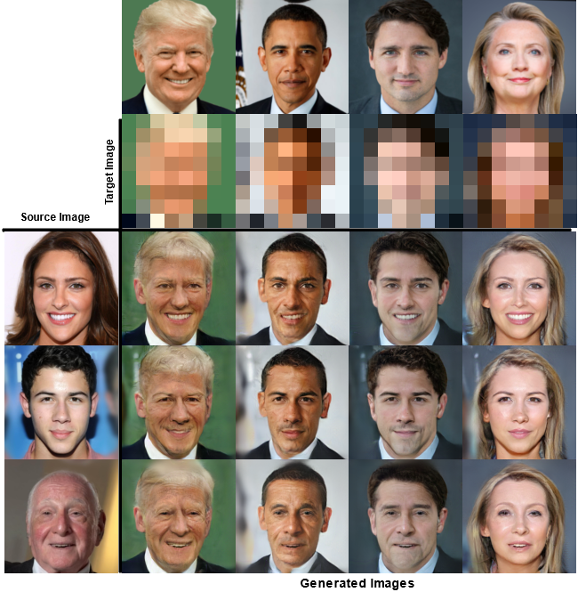
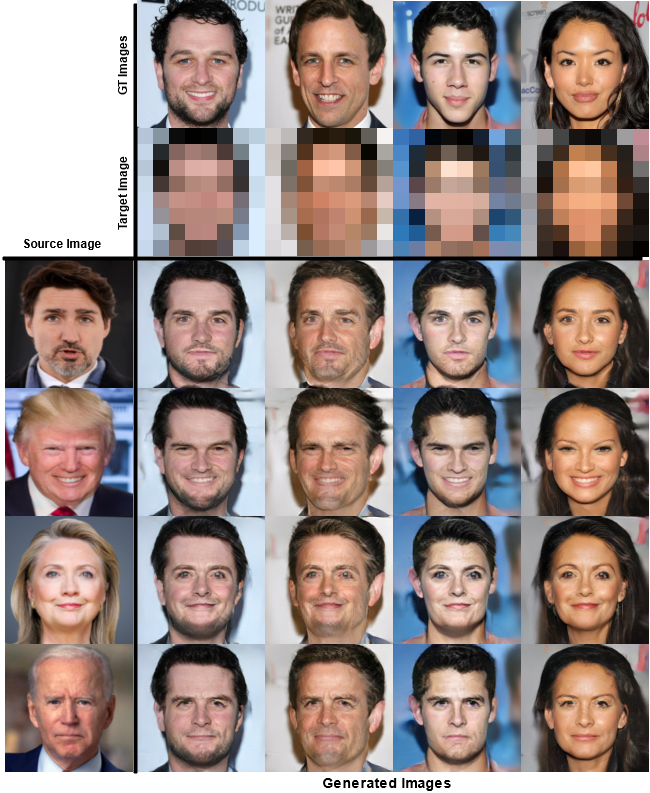

# I2I-LR

Official implementation of the paper "Image-to-Image Translation with Low Resolution conditioning" 

> Paper: https://arxiv.org/abs/2107.11262 

> **Abstract:** *Most image-to-image translation methods focus on learning mappings across domains with the assumption that images share content (e.g., pose) but have their own domain-specific information known as style. When conditioned on a target image, such methods aim to extract the style of the target and combine it with the content of the source image. In this work, we consider the scenario where the target image has a very low resolution. More specifically, our approach aims at transferring fine details from a high resolution (HR) source image to fit a coarse, low resolution (LR) image representation of the target. We therefore generate HR images that share features from both HR and LR inputs. This differs from previous methods that focus on translating a given image style into a target content, our translation approach being able to simultaneously imitate the style and merge the structural information of the LR target. Our approach relies on training the generative model to produce HR target images that both 1) share distinctive information of the associated source image; 2) correctly match the LR target image when downscaled. We validate our method on the CelebA-HQ and AFHQ datasets by demonstrating improvements in terms of visual quality, diversity and coverage. Qualitative and quantitative results show that when dealing with intra-domain image translation, our method generates more realistic samples compared to state-of-the-art methods such as Stargan-v2 *

## Results :

Generated images on CelebA-HQ :

Trained on CelebA-HQ and Tested on LR target from the internet :

Trained on CelebA-HQ and tested with source image from the internet:

## Dependecies
- Pytorch 1.5
- Cuda 10.1

## For evaluation metrics :
Please refer to :
- https://github.com/clovaai/stargan-v2/
- https://github.com/clovaai/generative-evaluation-prdc

